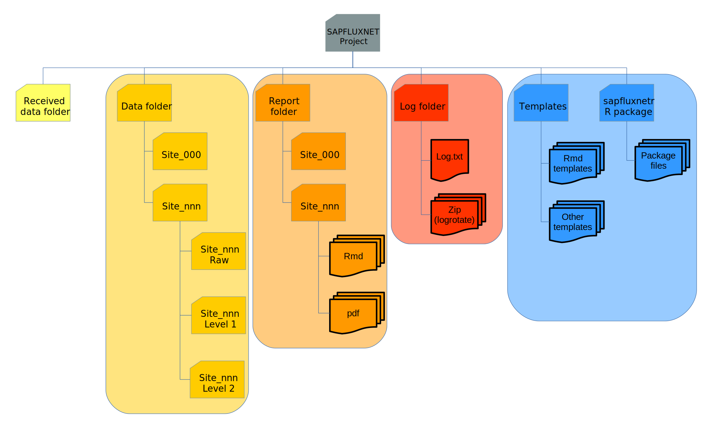
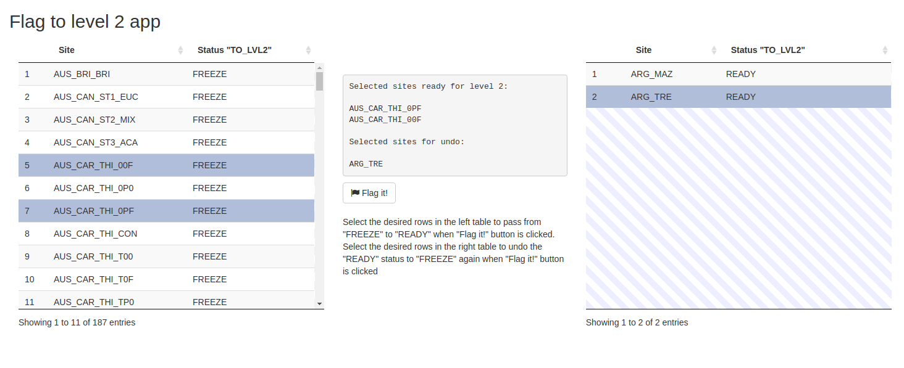
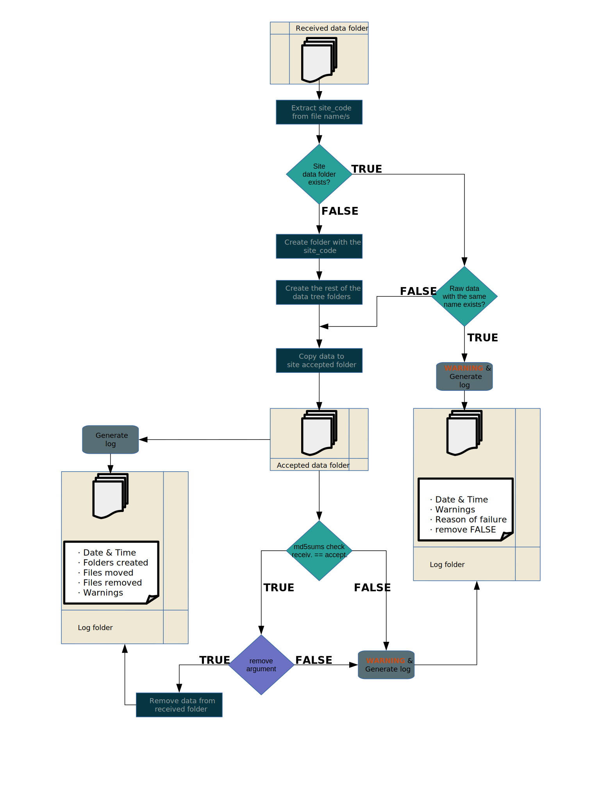
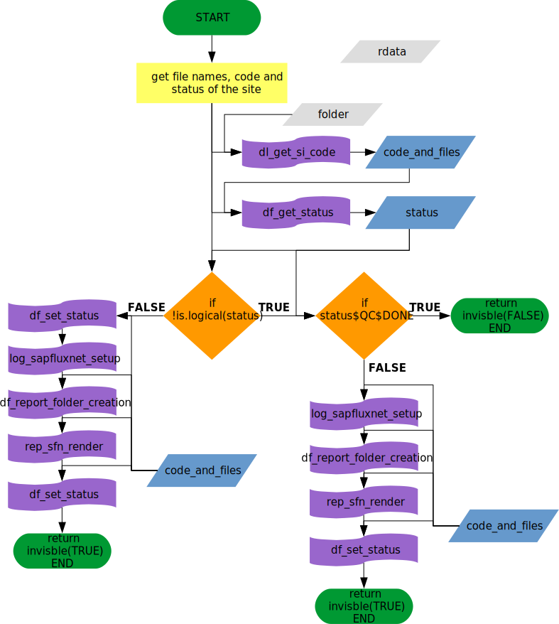
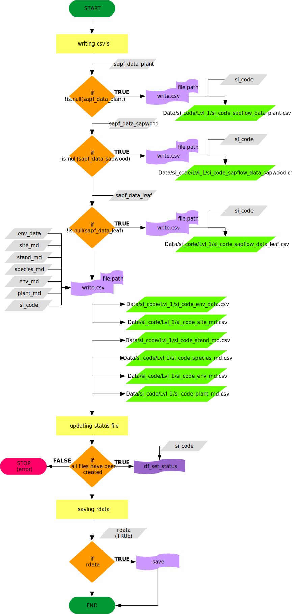

# Introduction

Data flow starts the moment a contributor send her/his data to the system. This
vignette documents the data journey through SAPFLUXNET Quality Control Process
to the final stored data.

## Folder tree

SAPFLUXNET folder tree is designed to allow an easy flow between different
quality control (QC) levels and easily acces to any intermediate data generated.
Figure 1 summarises the project folder tree:  

## SAPFLUXNET QC Process outline 

The main steps involved in the QC Process are summarised in the Figure 2

These steps can be automatic (those performed by calling `sapfluxnetQC1` functions)
or manual (manual intervention or *decision making* processes).

# Received to accepted

Each dataset submitted by the contributors is stored in the `received_data` folder.
When the QC Process starts, a copy of the data is saved in the
`Data/SITE_CODE/Accepted` folder and a report with the files copied is generated
to monitor all data flow.

# QC Process LEVEL 1

Data in the `Accepted` folder is ready to be submitted to the Level 1 quality
checks. In this level the data and metadata pass through several checks:

  1. Metadata validity checks
  1. Metadata variables presence/absence
  1. Metadata and Data concordance
  1. Data validity checks
  1. Data time series checks
  1. Data variables presence

An automatic report is generated in this step. This report is used to decide
if the dataset can be passed to LEVEL 2 or if manual changes and/or contributor
feedbak are needed.  
If everything is ok, data is stored in the `Data/SITE_CODE/Lvl_1` folder and
status file is updated.

## Manual changes and contributor feedback

If problems are found for the dataset and they can be solved without contributor
intervention, a manual changes log file is created for the dataset and all the
changes are documented. If contributor feedback is needed, the report is sent to
the contributor with the problems found asking for solution. Contributor
re-submission starts the process from the beginning.  
All datasets manually changed are previously copied to the `discarde_data` folder
in order to store the original submission.

## Data ready to LEVEL 2

Data does not load automatically to Level 2 QC, a *decision making* process is needed
to indicate which datasets are ready to Level 2. Figure 3 shows the shiny app
developed to perform this:

# QC Process LEVEL 2

When a site is ready to Level 2, data is checked for possible outliers and values
out of range and they are flagged. Data is then copied to the
`Data/SITE_CODE/Lvl_2/out_warn` folder waiting for the manual inspection of
these data flaws. Outliers detection is not perfect, and ranges for the data
(sapflow and environmental) depends on the units provided and site location, so
a manual process is needed to select those points to substitute or
remove (Figure 4).

## `received_data` folder

Each dataset submitted by contributors starts in the `received_data` folder.
Here data is stored temporarily until it is moved to the
`Data/site_code/Accepted` folder by executing `df_received_to_accepted` function
in the `sapfluxnetQC1` package.

## `df_received_to_accepted`

Figure 2 summarises the reasoning behind `df_received_to_accepted` function:

Site codes are extracted from file names, and the `Data` subfolders specific for
the sites are created. A warning is raised if folders already exists. If it is
the case, also the previous existence of the files is checked, and if they
exist, another warning is raised and the copy proccess is stopped.  
If files do not exist, they are copied to the `Data/site_code/Accepted` folder,
and a md5 checksum is made to ensure the integrity of the copies. Again, if
the checksum fails, a warning is raised and the proccess stops.  
Finally, depending on the value of the `remove` argument of the function, the
files in te `Received_data` folders are dropped (with a message) or not
(with a warning). All the proccess is logged at message level (messages,
warnings and errors).

## `discarded_data` folder

If manual changes are necessary, old original data is copied to the `discarded_data`
folder before any change is made. In this way an original copy of the data is
always preserved.

## QC process

Once the data is in the accepted folder, data quality checks must be run to
ensure data suitability.
QC is started with `qc_start_process`. This function checks all data status
files, and performs the QC on those without the QC **DONE** flag.  

Last step in the QC process is data flow to `Lvl_1` folder, indicating that
the data has been checked. This step is performed by the `df_accepted_to_lvl1`.  
function:

Data will stay in `Lvl_1` folder until the report produced is studied. If manual
or contributor side changes are necessary, those are made and the QC process
is re-runned (after changing the flags in the status file). If all is correct,
data can be moved to `Lvl_2` (yet to do).
