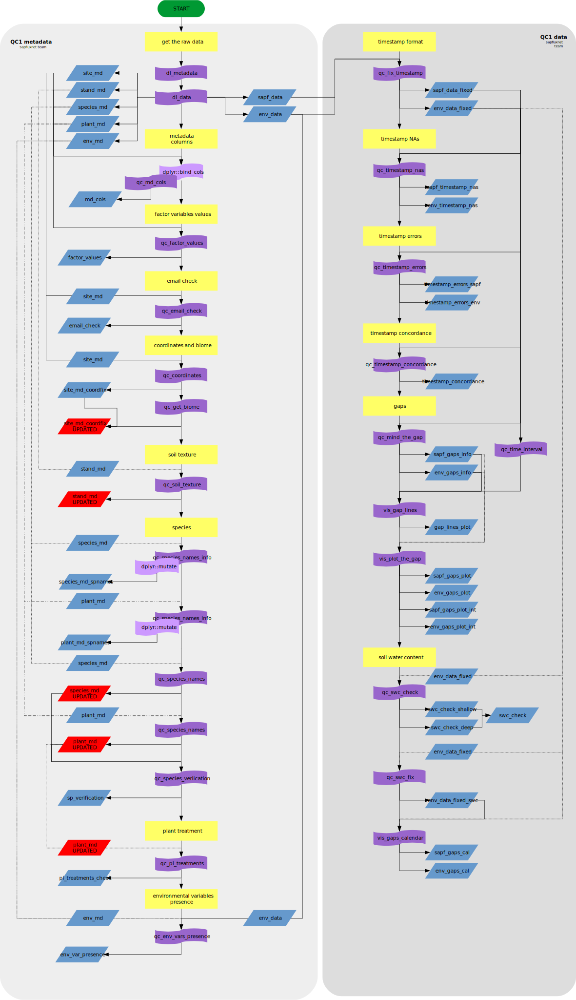

# Introduction

Data flow starts the moment a contributor send her/his data to the system. This
vignette documents the data journey through SAPFLUXNET Quality Control Process
to the final stored data.

## Folder tree

SAPFLUXNET folder tree is designed to allow an easy flow between different
quality control (QC) levels and easily acces to any intermediate data generated.
Figure 1 summarises the project folder tree:  

## SAPFLUXNET QC Process outline 

The main steps involved in the QC Process are summarised in the Figure 2

These steps can be automatic (those performed by calling `sapfluxnetQC1` functions)
or manual (manual intervention or *decision making* processes).

# Received to accepted

Each dataset submitted by the contributors is stored in the `received_data` folder.
When the QC Process starts, a copy of the data is saved in the
`Data/SITE_CODE/Accepted` folder and a report with the files copied is generated
to monitor all data flow.

# QC Process LEVEL 1

Data in the `Accepted` folder is ready to be submitted to the Level 1 quality
checks. This level is divided in metadata checks and data checks.

## Metadata checks

Metadata provided by the contributors is checked for:

  1. Metadata variables: All metadata variables are checked for presence and
     expected class (numeric, character, logical...).
  
  1. Character variables values: All metadata character variables are checked
     against the possible values (factor levels) for that variable, raising
     a warning if some value is out of the expected.
  
  1. E-mail check: E-mail provided by contributors is checked for validity
  
  1. Coordinates and biome: Site coordinates are checked for correctness (are
     they inside the specified country?) and fixed if needed and possible. MAT
     and MAP values are obtained for that coordinates and the biome is
     calculated from that values.
  
  1. Soil texture: Percentages of soil textures are used to calculate the
     USDA classification category if possible.
  
  1. Species names: Species names in plant and species metadata are checked for
     spelling errors and the concordance between both metadata is also checked.
  
  1. Plant treatments: Check for uniformity in the treatment declared by plant.
  
  1. Environmental variables presence: Check for concordance between the declared
     variables in the environmental metadata and the environmental data.

## Data checks

Data provided by the contributors is checked for:

  1. Timestamp correctness: Format, NA presence (there is data, but there is no
     timestamp), concordance and continuity are checked.
  
  1. Gap presence: Data gaps (There is TIMESTAMP but there is no data) are
     summarised and visualized.
     
  1. Soil water content checks: Check for percentage swc values and transform
     them to cm^3^/cm^3^
     

## Report QC1

Objects produced in the QC1 step are used to generate an automatic report.
This report is used to decide if the dataset can be passed to LEVEL 2 or if
manual changes and/or contributor feedback are needed.  
If everything is ok, data is stored in the `Data/SITE_CODE/Lvl_1` folder and
status file is updated.

## Manual changes and contributor feedback

If problems are found for the dataset and they can be solved without contributor
intervention, a manual changes log file is created for the dataset and all the
changes are documented. If contributor feedback is needed, the report is sent to
the contributor with the problems found asking for solution. Contributor
re-submission starts the process from the beginning.  
All datasets manually changed are previously copied to the `discarded_data` folder
in order to store the original submission.

## Data ready to LEVEL 2

Data does not load automatically to Level 2 QC, a *decision making* process is needed
to indicate which datasets are ready to Level 2. Figure 3 shows the shiny app
developed to perform this:

# QC Process LEVEL 2

The Level 2 QC is comprised by two main steps:

  1. Outliers and out of range checks
  1. Unit transformations and variables calculation

## Outliers and out of range values

When a site is ready to Level 2, data is checked for possible outliers and values
out of range and they are flagged. Data is then copied to the
`Data/SITE_CODE/Lvl_2/out_warn` folder waiting for the manual inspection of
these data flaws. Outliers detection is not perfect, and ranges for the data
(sapflow and environmental) depends on the units provided and site location, so
a manual process is needed to select those points to substitute or
remove (Figure 4).

Outliers selected in the manual process are substituted by values calculated
using the *Hampel filter*. Data substituted that way is flagged as `OUT_REMOVE`.  
Out of range values are removed and converted to `NA`. Data removed that way
is flagged as `RANGE_REMOVED`.  
Date ranges can be selected to remove them manually, as data can contains flaws
not being outliers or out of range values. Data removed that way is flagged as
`MANUAL_REMOVED`.  

This step generates a report (`LVL2_out_report`) with the info about the values
substituted/removed and the data is finally trasnferred to the
`Data/SITE_CODE/Lvl_2/out_rem` folder. Also in this step the status file is
updated again to reflect the new status.

### Outliers check

After the substitution/remove of the problematic data a manual process is needed
to check if everything is ok, as showed in the Figure 5:

## Unit transformations

If everything was ok in the outliers step, sapflow data is then transformed to
all available units (plant, sapwood and leaf level).  
In the same process, environmental variables not provided by the contributors can
be calculated:

  1. `ppfd_in` or `sw_in` from `sw_in` or `ppfd_in` respectively.
  1. `vpd` from `ta` and `rh`.
  1. `rh` from `vpd` and `ta`.
  1. `ext_rad` and `solarTIMESTAMP` from site location (latitude, longitude)

All variables calculated this way present the `CALCULATED` flag.

## Final data storage

After the units transformation step, data is finally stored in the
`Data/SITE_CODE/Lvl_2/unit_trans` folder, which can contain several folders:

  1. `plant` if the plant level units are available
  1. `sapwood` if the sapwood level units are available
  1. `leaf` if the leaf level units are available

Figure 6 summarises all the QC2 process:

