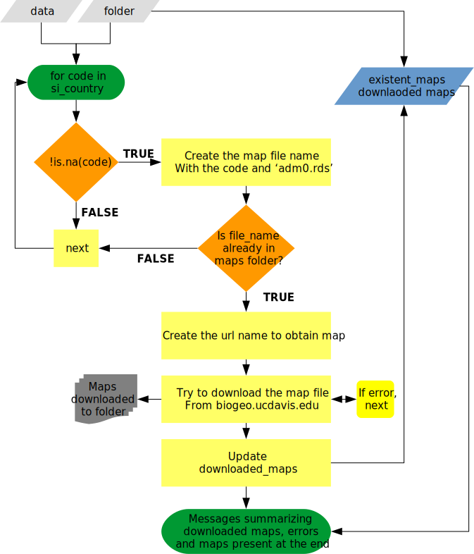
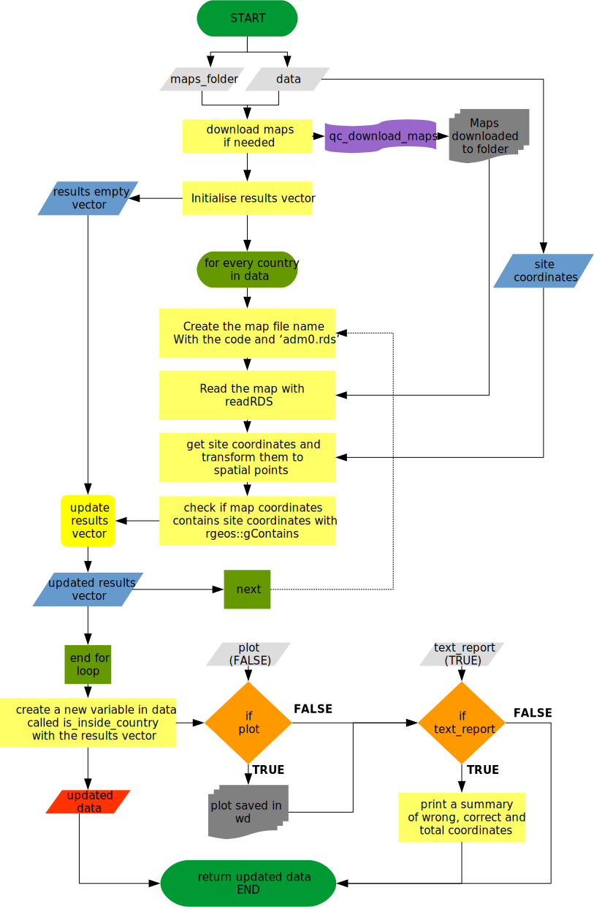
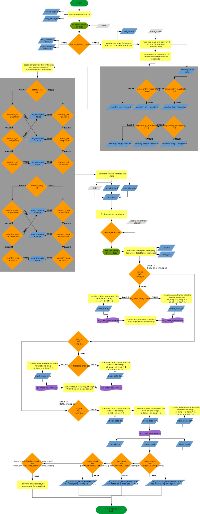

Quality check functions are intended to work together, but each of them has
its pecualirities. This vignette explain all written functions including
a diagram with the algorithm used and explanations when needed.

## `qc_download_maps`

This function fecth maps from [gadm](http://www.gadm.org/) if the maps are not
already downloaded in the maps folder specified. See function help for more
details in the arguments and expected value (`?qc_download_maps`).

## `qc_check_coordinates`

This function retrieves the coordinates provided fir the site, and check them
against the country coordinates. It uses `qc_download_maps` internally to
fecth any map if needed. See function help for more details in the
arguments and expected value (`?qc_check_coordinates`)

## `qc_coord_sign_test`

Internal function to establish countries coordinates sign and test if provided
site coordinates are correct. This function only provides info about the
possible sign changes, but fix is not made here. See function help for
more details about the arguments, special_countries step and expected value
(`?qc_cood_sign_test`).

