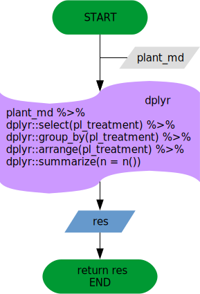

Quality check functions are intended to work together, but each of them has
its pecualirities. This vignette explain all written functions including
a diagram with the algorithm used and explanations when needed.

# Coordinates checks functions

These functions are intended to perform a quality check in the site coordinates
provided by the contributors. They involve downloading the country maps,
check de sign, fix the sign if needed and another checks. Finally, there is
a wrapper function (`qc_coordinates`) which allow to perform all the checks in
one step. This makes possible to add any new coordinates checks to the workflow
without gnereating so much complexity.

## `qc_download_maps`

This function fecth maps from [gadm](http://www.gadm.org/) if the maps are not
already downloaded in the maps folder specified. See function help for more
details in the arguments and expected value (`?qc_download_maps`).  

## `qc_check_coordinates`

This function retrieves the coordinates provided fir the site, and check them
against the country coordinates. It uses `qc_download_maps` internally to
fecth any map if needed. See function help for more details in the
arguments and expected value (`?qc_check_coordinates`).  

## `qc_coord_sign_test`

Internal function to establish countries coordinates sign and test if provided
site coordinates are correct. This function only provides info about the
possible sign changes, but fix is not made here. See function help for
more details about the arguments, special_countries step and expected value
(`?qc_cood_sign_test`).  

## `qc_fix_latlong_errors`

This function fixes several known errors in the coordinates provided for the site.
It is intended to be modular, being able to add new fixes if needed, as this
function uses other internal functions as `qc_check_coordinates` and
`qc_coord_sign_test`. See function help for more details about the arguments,
(`?qc_fix_latlong_errors`).  

## `qc_coordinates`

Wrapper around all the previous functions to perform the coordinates quality
check in only one step. See function help for more details about the arguments,
(`?qc_coordinates`).  

# Data general checks functions

These functions perform general checks within the data (environmental and
sapflow). At the moment, most of the checks are related to the TIMESTAMP.

## `qc_is_timestamp`

This function tests if TIMESTAMP variable is in POSIXct format, as expected. See
function help for more details about the arguments, (`?qc_is_timestamp`).  

## `qc_get_timezone`

Function to transform the provided ISO coded timezone value (`env_time_zone`
variable) in a character string compatible with `lubridate` package and POSIXct
format. See function help for more details about the arguments,
(`?qc_get_timezone`).  

## `qc_set_timezone`

When reading data from csv, TIMESTAMP timezone is settled to `UTC`. This
function allows setting the TIMESTAMP timezone without changing the variable.
See function help for more details about the arguments, (`?qc_set_timezone`).  

## `qc_as_timestamp`

When loading the TIMESTAMP varible, specially from csv files, sometimes results
in bad formatted TIMESTAMP. This function looks for known bad formats and fix
them. It uses internally `qc_is_timestamp`, `qc_get_timezone` and `qc_set_timezone`
to achieve the correct TIMESTAMP format. See function help for more details
about the arguments, (`?qc_as_timestamp`).  

## `qc_fix_timestamp`

Wrapper for timestamp functions. It uses internally `qc_is_timestamp` and
`qc_as_timestamp` to check and fix, if possible, the TIMESTAMP. See funtion help
for more details about arguments, (`?qc_fix_timestamp`).  

## `qc_get_timestep`

Helper function to retrieve the timestep from the from the plant (sapflow) or
the environmental metadata. This helper function will be used in the
`qc_timestamp_errors` function. See function help for more details about the
arguments, (`?qc_get_timestep`).

## `qc_timestamp_errors`

Function to identify known errors in TIMESTAMP variable. A summary of intervals
59 seconds away from the declared timestep is presented in order to locate the
errors. See function help for more details about the arguments,
(`?qc_timestamp_errors`).

## `qc_time_interval`

This function obtains a summary of the inital and final time (t0 and tf) of
each object in the data (plants or environmental variables). See function help
for more details about the arguments, (`?qc_time_interval`).

## `qc_timestamp_concordance`

Function to retrieve numerical or graphical information about concordance in
the timestamp for both, environmental and sapflow data. See function help for
more details about the arguments, (`?qc_timestamp_concordance`).

## `qc_solar_timestamp`

TO DO

# Gaps functions

Functions for characterise the gaps (type, length...).

## `qc_mind_the_gap`

This function obtains info about the gaps and display it in a summary data frame.
See function help for details about the arguments, (`?qc_mind_the_gap`).  

# Metadata general checks

Functions to perform the quality check in the metadata. They include the five
kinds of metadata (site, stand, plant, species and environmental) as well as
the interface between metadata and data (checks that involves both kind of data).

## `create_dic`

This function creates dictionaries (named lists) for the specified kind of
metadata, including the name of the metadata variables as labels and their
expected class as the value. This provides a reference to check if the class is
OK with the `qc_md_cols` function. See function help for details about the
arguments, (`?create_dic`).

## `qc_site_dics`

This function creates a dictionary (character vector) with the allowed values
for the factor variable of site metadata specified in the arguments. See function
help for details about the arguments, (`?qc_site_dics`).  

## `qc_stand_dics`

This function creates a dictionary (character vector) with the allowed values
for the factor variable of stand metadata specified in the arguments. See function
help for details about the arguments, (`?qc_stand_dics`).  

## `qc_species_dics`

This function creates a dictionary (character vector) with the allowed values
for the factor variable of species metadata specified in the arguments. See function
help for details about the arguments, (`?qc_species_dics`).  

## `qc_plant_dics`

This function creates a dictionary (character vector) with the allowed values
for the factor variable of plant metadata specified in the arguments. See function
help for details about the arguments, (`?qc_plant_dics`).  

## `qc_env_dics`

This function creates a dictionary (character vector) with the allowed values
for the factor variable of environmental metadata specified in the arguments.
See function help for details about the arguments, (`?qc_env_dics`).  

## `qc_md_cols`

This functions checks for presence, NAs and classes of the variables provided
in the different kinds of metadata, buiding a summary data frame as result.
See function help for details about the arguments, (`?qc_md_cols`).

## `qc_factor_values`

This function checks if the values provided for the factor metadata variables are
allowed values. See function help for details about the arguments,
(`?qc_factor_values`).  

## `qc_env_vars_presence`

This function check the presence in the environmental data of variables
declared as measured in the environmental metadata. See function help for details
about arguments, (`?qc_env_vars_presence`)

## `qc_pl_treatments`

This function summarizes the treatments declared in the plant metadata to look
for mispelling and concordance errors. Results are summarised in a data frame.
See function help for details about arguments, (`?qc_pl_treatments`).  

## `qc_email_check`

This function checks if the email provided is a correct formatted email
direction. See function help for details about arguments, (`?qc_email_check`).  

## `qc_species_names_info`

This function uses the tpl and tpl_data packages (from github) to obtain
the correct species names (if any correction is needed). A summary data frame
is returned to use in `qc_species_names_fix` function.
See function help for details about arguments, (`?qc_species_names_info`).  

## `qc_species_names_fix`

This function takes the results of `qc_species_names_info` and return the
tpl names if no NAs has been generated.
See function help for details about arguments, (`?qc_species_names_fix`).  

## `qc_species_names`

Wrapper for species_names_info and species_names_fix.
See function help for details about arguments, (`?qc_species_names`).  

## `qc_species_verification`

This function return a summary indicating if the species declared in the
species metadata are the same that those indicated in the plant metadata.
See function help for details about arguments, (`?qc_species_verification`).  

# Ranges checks

This group of functions check that the provided numerical values are within the
natural/typical/known ranges. It is a work in progress.

## `qc_suitable_range`

Function to check if the numerical value provided is within the ranges provided.
It is a wrapper for functions yet to do.

## `qc_sapf_range_check`

Function to make a suitability test in the sap flow values provided. Values
are tested to be within the ranges for sap flow measures observed in the
literature. See function help for details about arguments,
(`?qc_sapf_range_check`).  

