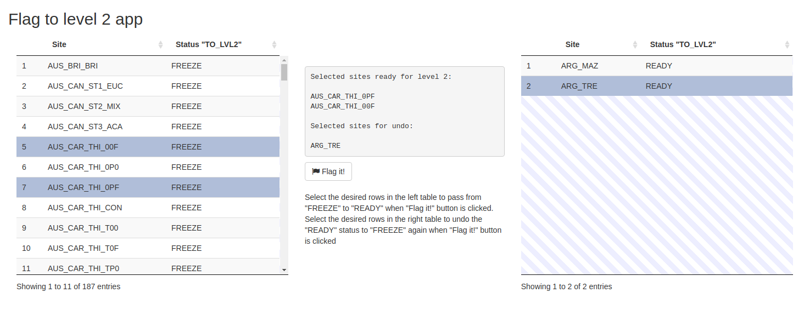

`sapfluxnetQC1` functions are intended to work together, but each of them has
its peculiarities.  
This vignette explain the rationale behind the functions of the `sapfluxnetQC1`
package. That include a flowchart explaining the function and further explanations
when needed. For info about the function usage or arguments needed see
the corresponding function help (`?function_name`).  

## `create_dic`

This function creates dictionaries (named lists) for the specified kind of
metadata, including the name of the metadata variables as labels and their
expected class as the value. This provides a reference to check if the class is
OK with the `qc_md_cols` function. See function help for details about the
arguments, (`?create_dic`).

## `df_accepted_to_lvl1`

This function performs two actions:

1. write csv files with the fixed data in the LVL1 folder.

2. Update the status files to indicate that data is in LVL1 and the date of the
   move.

See function help for details about arguments, (`?df_accepted_to_lvl1`).  

## `df_copy_templates`

This function copies/updates the templates in the server (Rmd files and R scripts).
See function help for details about arguments (`?df_copy_templates`).

## `df_flag_to_lvl2_app`

This function generates an interactive shiny app to flag those sites ready for
Level 2.  

## `df_folder_structure`

This functions only need to be called once, as it creates the needed folder
structure to recreate SAPFLUXNET project in any environment.
See function help for details about the arguments, (`?df_folder_structure`).  

## `df_get_data_folders`

This function gets the data folder names to be able to start automatically the
QC process.
See function help for details about arguments, (`?df_get_data_folders`).  

## `df_get_status`

Retrieve the status file info as a list, with the yaml package.
See the function help for details about the arguments, (`?df_get_status`).  

## `df_lvl1_to_lvl2`

This function is in charge of check for sites ready to pass to Level 2, create
the needed folder structure, flag for outliers warnings and saving the final
SfnData objects in the corresponding folder.

## `df_lvl2_folder_structure`

This function takes a site code and build the level 2 folder strucuture for that
site.

## `df_read_SfnData`

This function loads the specified level SfnData object.

## `df_received_to_accepted`

This function is in charge of move the data from the received folder to the
accepted data folder (within the `code` folder).
See function help for details about arguments, (`?df_received_to_accepted`).  

## `df_rem_to_units`

This function is in charge of checking the sites ready to pass to out_units,
performing the available transformations and writing the resulting SfnData in the
destination folder.

## `df_report_folder_creation`

Function to create the report subfolder for the site to analyze.
See function help for details about arguments, (`?df_report_folder_creation`).  

## `df_reset_data_status`

This function allows for resetting the status of a site to the required level.
For that, the status file is changed accordingly and all stored files for the
site in the resetted levels are renamed to bak files.

## `df_set_status`

Change and update status file info using yaml package.
See function help for details about arguments, (`?df_set_status`).  

## `df_start_status`

Initialise an empty status file in yaml format, using the `yaml` package.
See function help for details about arguments, (`?df_start_status`).  

## `df_warn_to_rem`

This function is in charge of checking the sites ready to pass to out_rem,
removing the outliers indicated in the accesory files and saving the final
SfnData object in the corresponding folder.

## `df_whos_ready_to`

This function checks the site status files to list who is ready to move to the
indicated target (level).

## `df_write_SfnData`

This function writes the SfnData object in the specified level.

## `dl_data`

This function make use of dplyr, tidyr and readxl packages in order to
retrieve and format the data. Also, in the case of csv files it uses
data.table package.
See function help for details about the arguments, (`?dl_data`).  

## `dl_data_col_classes`

Checking and setting data column classes to numeric.
See function help for details about arguments, (`?dl_data_col_classes`).  

## `dl_dec_char_detect`

Decimal character detection to csv files loading with `data.table::fread`.
See function help for details about arguments, (`?dl_dec_char_detect`).  

## `dl_get_si_code`

Look at the data folder provided and get the code and the names of the files
with the metadata, sapflow data and environmental data, in order to use them
as parameters in the automated reports.
See function help for details about arguments, (`?dl_get_si_code`).  

## `dl_metadata`

This function make use of dplyr, tidyr and readxl packages in order to
retrieve and format the metadata. It's intended to be used as first step
to load the metadata and start the metadata quality check.
See function help for details about the arguments, (`?dl_metadata`).  

## `dl_na_char_generator`

Generation of a character vector with the possible na characters found in
csv files in order to load data with `data.table::fread`.
See function help for details about arguments, (`?dl_na_char_generator`).  

## `get_env` (SfnData get method)

Method to get the environmental data from a SfnData object

## `get_env_flags` (SfnData get method)

Method to get the environmental flags from a SfnData object

## `get_*_md`, `get_timestamp`, `get_solar_timestamp`, `get_si_code`

Methods to get the ancillary metadata objects

## `<- replacement methods` (SfnData replacement method)

Method to set the data or metadata in a SfnData object

## `get_sapf` (SfnData get method)

Method to get the sapflow data from a SfnData object

## `get_sapf_flags` (SfnData get method)

Method to get the sapflow flags from a SfnData object

## `log_sapfluxnet_action`

Custom logging handler action for SAPFLUXNET project

## `log_sapfluxnet_format`

Custom log formatter for SAPFLUXNET Project
See function help for details about arguments, (`?log_sapfluxnet_format`).  

## `log_sapfluxnet_setup`

Setting up the SAPFLUXNET Project log handler.
See function help for details about arguments, (`?log_sapfluxnet_setup`).  

## `out_app`

Shiny app to flag values to remove ranges and flaws and substitute outliers to
start level 2 QC

## `out_confirmation_app`

Shiny app to confirm the removed/subsituted values in the level 2 process

## `plot` (SfnData plot method)

plot method for SfnData objects. It generates ggplot2 objects instead regular plots

## `qc_as_timestamp`

When loading the TIMESTAMP varible, specially from csv files, sometimes results
in bad formatted TIMESTAMP. This function looks for known bad formats and fix
them. It uses internally `qc_is_timestamp`, `qc_get_timezone` and `qc_set_timezone`
to achieve the correct TIMESTAMP format.  

## `qc_check_coordinates`

This function retrieves the coordinates provided fir the site, and check them
against the country coordinates. It uses `qc_download_maps` internally to
fecth any map if needed.  

## `qc_cm_cm_h`

Conversion of sap flow units to sapwood level
(cm³·cm⁻²·h⁻¹), plant level (cm³·h⁻¹) or leaf area level (cm³·cm⁻²·h⁻¹). This
documentation is valid for this function as well as all other functions for
unit conversion (`qc_cm_cm_h`, `qc_cm_m_s`, `qc_dm_dm_h`, `qc_dm_dm_s`,
`qc_mm_mm_s`, `qc_g_m_s`, `qc_kg_m_h`, `qc_kg_m_s`, `qc_cm_s`, `qc_cm_h`,
`qc_dm_h`, `qc_g_h`, `qc_kg_h`).  

## `qc_coordinates`

Wrapper around all the previous functions to perform the coordinates quality
check in only one step. See function help for more details about the arguments,
(`?qc_coordinates`).  

## `qc_coord_sign_test`

Internal function to establish countries coordinates sign and test if provided
site coordinates are correct. This function only provides info about the
possible sign changes, but fix is not made here. See function help for
more details about the arguments, special_countries step and expected value
(`?qc_cood_sign_test`).  

## `qc_data_results_table`

Data QC codified results in one data frame.
See function help for details about arguments, (`?qc_data_results_table`).  

## `qc_download_maps`

This function fecth maps from [gadm](http://www.gadm.org/) if the maps are not
already downloaded in the maps folder specified. See function help for more
details in the arguments and expected value (`?qc_download_maps`).  

## `qc_email_check`

This function checks if the email provided is a correct formatted email
direction. See function help for details about arguments, (`?qc_email_check`).  

## `qc_env_dics`

This function creates a dictionary (character vector) with the allowed values
for the factor variable of environmental metadata specified in the arguments.
See function help for details about the arguments, (`?qc_env_dics`).  

## `qc_env_ranges`

Check ranges for environmental variables

## `qc_env_vars_presence`

This function check the presence in the environmental data of variables
declared as measured in the environmental metadata. See function help for details
about arguments, (`?qc_env_vars_presence`)

## `qc_ext_radiation`

Calculates the Extraterrestrial Radiation from the TIMESTAMP, and also
calculates the solar TIMESTAMP

## `qc_factor_values`

This function checks if the values provided for the factor metadata variables are
allowed values.  

## `qc_fix_latlong_errors`

This function fixes several known errors in the coordinates provided for the site.
It is intended to be modular, being able to add new fixes if needed, as this
function uses other internal functions as `qc_check_coordinates` and
`qc_coord_sign_test`.  

## `qc_fix_timestamp`

Wrapper for timestamp functions.  

## `qc_get_biome`

Retrieves the mean annual temperature, mena annual precipitation from
WorldClim 1.4 and calculate the biome based on `qc_get_biomes_spdf`

## `qc_get_biomes_spdf`

Creates a SpatialPolygonsDataFrame object of the Whittaker's biomes modified by
Ricklefs (2008) in function of mean annual temperature (MAT) and mean annual
precipitation (MAP) (MAT in degree Celsius and MAP in mm).

## `qc_get_sapw_md`

Simple function to retrieve the metadata variables related with sapwood.
See function help for details about arguments, (`?qc_get_sapw_md`).  

## `qc_get_timestep`

Helper function to retrieve the timestep from the from the plant (sapflow) or
the environmental metadata. This helper function will be used in the
`qc_timestamp_errors` function.

## `qc_get_timezone`

Function to transform the provided ISO coded timezone value (`env_time_zone`
variable) in a character string compatible with `lubridate` package and POSIXct
format.  

## `qc_is_timestamp`

This function tests if TIMESTAMP variable is in POSIXct format, as expected.  

## `qc_md_cols`

This functions checks for presence, NAs and classes of the variables provided
in the different kinds of metadata, buiding a summary data frame as result.
See function help for details about the arguments, (`?qc_md_cols`).

## `qc_md_results_table`

Metadata QC codified results in one data frame.  

## `qc_mind_the_gap`

This function obtains info about the gaps and display it in a summary data frame.
See function help for details about the arguments, (`?qc_mind_the_gap`).  

## `qc_outliers_process`

This function substitute the outliers based on the *_to_remove files found
in the out_warn folder for any site

# Coordinates checks functions

These functions are intended to perform a quality check in the site coordinates
provided by the contributors. They involve downloading the country maps,
check de sign, fix the sign if needed and another checks. Finally, there is
a wrapper function (`qc_coordinates`) which allow to perform all the checks in
one step. This makes possible to add any new coordinates checks to the workflow
without gnereating so much complexity.

# Data general checks functions

These functions perform general checks within the data (environmental and
sapflow). At the moment, most of the checks are related to the TIMESTAMP.

## `qc_set_timezone`

When reading data from csv, TIMESTAMP timezone is settled to `UTC`. This
function allows setting the TIMESTAMP timezone without changing the variable.
See function help for more details about the arguments, (`?qc_set_timezone`).  

## `qc_timestamp_errors`

Function to identify known errors in TIMESTAMP variable. A summary of intervals
59 seconds away from the declared timestep is presented in order to locate the
errors. See function help for more details about the arguments,
(`?qc_timestamp_errors`).

## `qc_time_interval`

This function obtains a summary of the inital and final time (t0 and tf) of
each object in the data (plants or environmental variables). See function help
for more details about the arguments, (`?qc_time_interval`).

## `qc_timestamp_concordance`

Function to retrieve numerical or graphical information about concordance in
the timestamp for both, environmental and sapflow data. See function help for
more details about the arguments, (`?qc_timestamp_concordance`).

## `qc_solar_timestamp`

TO DO

# Gaps functions

Functions for characterise the gaps (type, length...).

# Metadata general checks

Functions to perform the quality check in the metadata. They include the five
kinds of metadata (site, stand, plant, species and environmental) as well as
the interface between metadata and data (checks that involves both kind of data).

## `qc_site_dics`

This function creates a dictionary (character vector) with the allowed values
for the factor variable of site metadata specified in the arguments. See function
help for details about the arguments, (`?qc_site_dics`).  

## `qc_stand_dics`

This function creates a dictionary (character vector) with the allowed values
for the factor variable of stand metadata specified in the arguments. See function
help for details about the arguments, (`?qc_stand_dics`).  

## `qc_species_dics`

This function creates a dictionary (character vector) with the allowed values
for the factor variable of species metadata specified in the arguments. See function
help for details about the arguments, (`?qc_species_dics`).  

## `qc_plant_dics`

This function creates a dictionary (character vector) with the allowed values
for the factor variable of plant metadata specified in the arguments. See function
help for details about the arguments, (`?qc_plant_dics`).  

## `qc_pl_treatments`

This function summarizes the treatments declared in the plant metadata to look
for mispelling and concordance errors. Results are summarised in a data frame.
See function help for details about arguments, (`?qc_pl_treatments`).  

## `qc_species_names_info`

This function uses the tpl and tpl_data packages (from github) to obtain
the correct species names (if any correction is needed). A summary data frame
is returned to use in `qc_species_names_fix` function.
See function help for details about arguments, (`?qc_species_names_info`).  

## `qc_species_names_fix`

This function takes the results of `qc_species_names_info` and return the
tpl names if no NAs has been generated.
See function help for details about arguments, (`?qc_species_names_fix`).  

## `qc_species_names`

Wrapper for species_names_info and species_names_fix.
See function help for details about arguments, (`?qc_species_names`).  

## `qc_species_verification`

This function return a summary indicating if the species declared in the
species metadata are the same that those indicated in the plant metadata.
See function help for details about arguments, (`?qc_species_verification`).  

# Ranges checks

This group of functions check that the provided numerical values are within the
natural/typical/known ranges. It is a work in progress.

## `qc_suitable_range`

Function to check if the numerical value provided is within the ranges provided.
It is a wrapper for functions yet to do.

## `qc_sapf_range_check`

Function to make a suitability test in the sap flow values provided. Values
are tested to be within the ranges for sap flow measures observed in the
literature. See function help for details about arguments,
(`?qc_sapf_range_check`).  

# Unit transformation functions

Family of functions dedicated to extract the sapwood metadata, calculate the
sapwood area if not provided and convert between units and sapflow measure levels
(plant, sapwood and leaf area).

## `qc_sapw_area_calculator`

Function to calculate sapwood area from DBH, bark thickness and sapwood depth.
See function help for details about arguments, (`?qc_sapw_area_calculator`).  

## `qc_cm_cm_h`

Conversion of sap flow units to sapwood level
(cm³·cm⁻²·h⁻¹), plant level (cm³·h⁻¹) or leaf area level (cm³·cm⁻²·h⁻¹). This
documentation is valid for this function as well as all other functions for
unit conversion (`qc_cm_cm_h`, `qc_cm_m_s`, `qc_dm_dm_h`, `qc_dm_dm_s`,
`qc_mm_mm_s`, `qc_g_m_s`, `qc_kg_m_h`, `qc_kg_m_s`, `qc_cm_s`, `qc_cm_h`,
`qc_dm_h`, `qc_g_h`, `qc_kg_h`). See function(s) help for details about
arguments, (`?qc_cm_cm_h`).

## `qc_sapw_conversion`

Wrapper for unit conversion functions, from the units declared in metadata
to the desired output units.
See function help for details about arguments, (`?qc_sapw_conversion`).

## `qc_soil_texture` 

Function that gives the soil texture classification of the USDA in function of 
the percentages of clay, silt and sand present in the data frame dealing with 
the stand's metadata.
Sometimes, some percentages are missing: in this case, the function looks at 
the metadata "st_soil_texture". If a classification is given, then the function
will return this classification. If there is no information about the 
classification, a warning message explains that some information about the soil 
texture is missing.

# Report functions

Family of functions dedicated to generate the html reports.

## `rep_sfn_render`

Wrap around rmarkdown::render function to generate the automatic reports.
See function help for details about arguments, (`?rep_sfn_render`).  

# Visualization functions

Functions dedicated to generate plots or visualizations of data and metadata

## `vis_gaps_calendar`

This function generates a calendar heatmap to visualize the gaps density. Plot
is generated as a `ggplot` object, so post-modifications are allowed.
See function help for details about arguments, (`?vis_gaps_calendar`).  

## `vis_plot_the_gap`

This function is a simple wrapper for ggplot + geom_histogram. It produces
a ggplot object that can be modified adding layers, like any other ggplot
object.
See function help for details about arguments, (`?vis_plot_the_gap`).  

## `vis_gap_lines`

TIMESTAMP concordance line plot, with gaps.
See function help for details about the arguments, (`?vis_gap_lines`).  

# Data flow functions

Functions to manage the movement of files between folders in the server tree.

# Data Load functions

Functions to load data and metadata, as well as helper functions to aid with
the automatic detection of format of raw data.

## `remove_dupcols`

`remove_dupcols` is an internal function to use inside of the `dl_*`
functions. It checks for duplicate column names and drop them.
See function help for details about arguments, (`?remove_dupcols`).  

## `dl_data`

This function make use of dplyr, tidyr and readxl packages in order to
retrieve and format the data. Also, in the case of csv files it uses
data.table package.
See function help for details about the arguments, (`?dl_data`).  

# Logging functions

Family of functions dedicated to setup, maintain and configure the logging
process

# Main functions

Main functions for starting QC procces, getting si_code and generate results
tables.

## `qc_start_process`

Start QC process from the site code.
See function help for details about arguments, (`?qc_start_process`).  

