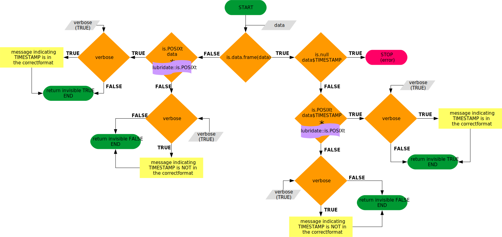

Quality check functions are intended to work together, but each of them has
its pecualirities. This vignette explain all written functions including
a diagram with the algorithm used and explanations when needed.

# Coordinates checks functions

These functions are intended to perform a quality check in the site coordinates
provided by the contributors. They involve downloading the country maps,
check de sign, fix the sign if needed and another checks. Finally, there is
a wrapper function (`qc_coordinates`) which allow to perform all the checks in
one step. This makes possible to add any new coordinates checks to the workflow
without gnereating so much complexity.

## `qc_download_maps`

This function fecth maps from [gadm](http://www.gadm.org/) if the maps are not
already downloaded in the maps folder specified. See function help for more
details in the arguments and expected value (`?qc_download_maps`).  

## `qc_check_coordinates`

This function retrieves the coordinates provided fir the site, and check them
against the country coordinates. It uses `qc_download_maps` internally to
fecth any map if needed. See function help for more details in the
arguments and expected value (`?qc_check_coordinates`).  

## `qc_coord_sign_test`

Internal function to establish countries coordinates sign and test if provided
site coordinates are correct. This function only provides info about the
possible sign changes, but fix is not made here. See function help for
more details about the arguments, special_countries step and expected value
(`?qc_cood_sign_test`).  

## `qc_fix_latlong_errors`

This function fixes several known errors in the coordinates provided for the site.
It is intended to be modular, being able to add new fixes if needed, as this
function uses other internal functions as `qc_check_coordinates` and
`qc_coord_sign_test`. See function help for more details about the arguments,
(`?qc_fix_latlong_errors`).  

## `qc_coordinates`

Wrapper around all the previous functions to perform the coordinates quality
check in only one step. See function help for more details about the arguments,
(`?qc_coordinates`).  

# Data general checks functions

These functions perform general checks within the data (environmental and
sapflow). At the moment, most of the checks are related to the TIMESTAMP.

## `qc_is_timestamp`

This function tests if TIMESTAMP variable is in POSIXct format, as expected. See
function help for more details about the arguments, (`?qc_is_timestamp`).  

## `qc_get_timezone`

Function to transform the provided ISO coded timezone value (`env_time_zone`
variable) in a character string compatible with `lubridate` package and POSIXct
format. See function help for more details about the arguments,
(`?qc_get_timezone`).  

## `qc_set_timezone`

When reading data from csv, TIMESTAMP timezone is settled to `UTC`. This
function allows setting the TIMESTAMP timezone without changing the variable.
See function help for more details about the arguments, (`?qc_set_timezone`).  

## `qc_as_timestamp`

When loading the TIMESTAMP varible, specially from csv files, sometimes results
in bad formatted TIMESTAMP. This function looks for known bad formats and fix
them. It uses internally `qc_is_timestamp`, `qc_get_timezone` and `qc_set_timezone`
to achieve the correct TIMESTAMP format. See function help for more details
about the arguments, (`?qc_as_timestamp`).  

## `qc_fix_timestamp`

Wrapper for timestamp functions. It uses internally `qc_is_timestamp` and
`qc_as_timestamp` to check and fix, if possible, the TIMESTAMP. See funtion help
for more details about arguments, (`?qc_fix_timestamp`).  

## `qc_get_timestep`

Helper function to retrieve the timestep from the from the plant (sapflow) or
the environmental metadata. This helper function will be used in the
`qc_timestamp_errors` function. See function help for more details about the
arguments, (`?qc_get_timestep`).

