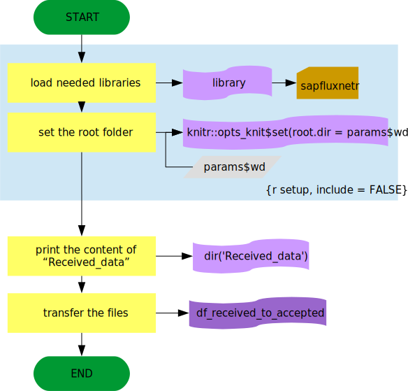
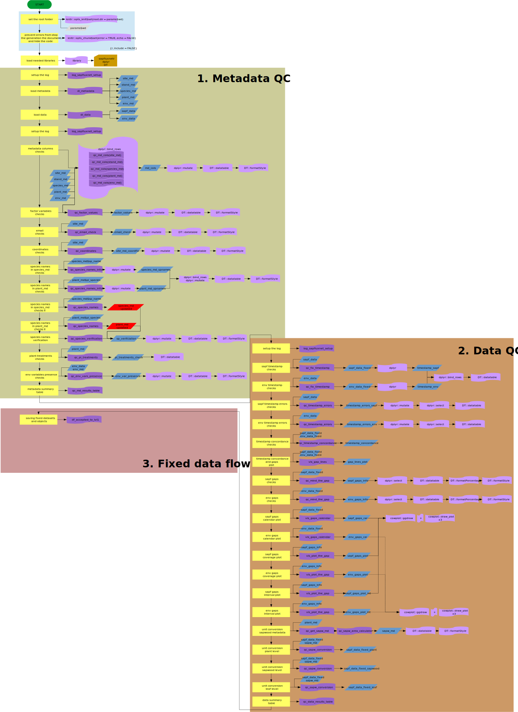

Reports are an essential part of the data ingestion procces for the SAPFLUXNET
project. More important, besides the checks and quality control results, reports
are used to generate the temporal and intermediate data to be stored in the different
stages of the project.  
All reports are done with RMarkdown documents, which provide an isolated environment
for all the data flow, checks... and make all analyses reproducible.  
This vignette explains the work flow in each report generated in the Quality
Control.

## Received to accepted report

This is the first step in the data flow, involving the move from received data
folder to accepted folder in roder to start the QC process.
This report gives info about the content of the `Received_data` folder, as well
as any warning or error raised during the process of moving the files.

### Flow diagram of received_to_accepted.Rmd document

## QC report

Main report, where all the QC process is done and reported. This report provides
a summary for the metadata and the data, as well as a section for each check
done with the metadata and the data.  
Last but not least, the code in the report is in charge of generate the fixed
data (if needed), the intermediate r objects and move the fixed data to the
level 1 data folder.

### Flow diagram of QC_report.Rmd document

